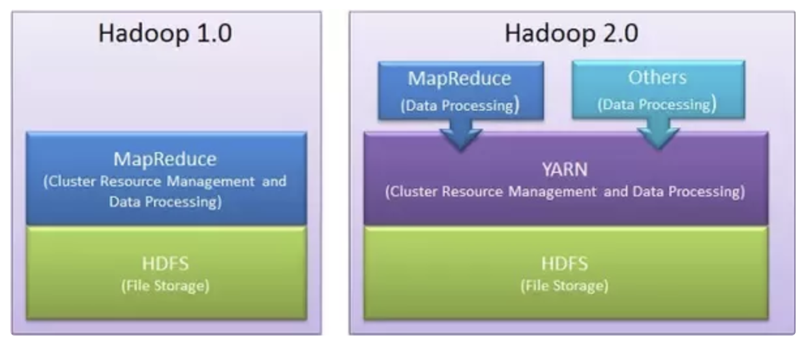
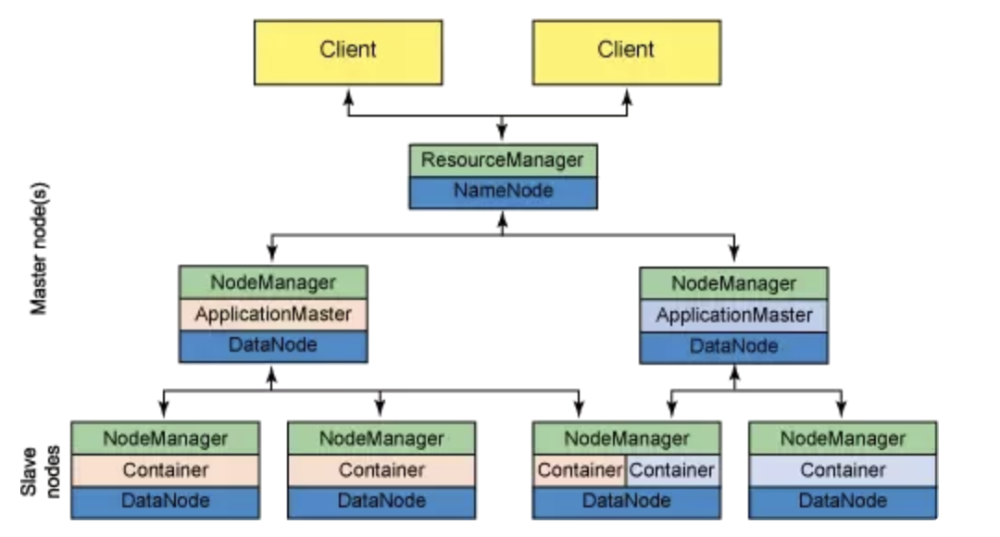
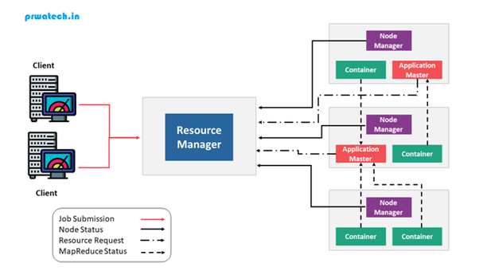

# What is Apache Hadoop YARN?

YARN(Yet Another Resources Negotiator)은 MapReduce 등 다양한 분산 처리 프레임워크에 클러스터 리소스 관리 기능을 제공하는 미들웨어다.
Hadoop 1.x 까지는 Hadoop/MapReduce 자체에 내장되어 있었지만 
Hadoop 2.x부턴 클러스터 리소스를 다른 분산 처리 프레임워크와 공유하기 위해 YARN이란 이름으로 분리되었다.

## 1. YARN 도입 배경

### 1.1. 기존 MapReduce의 역할
YARN이 도입되기 전 Hadoop/MapReduce에서 JobTracker, TaskTracker의 역할은 다음과 같았다.
- <b>JobTrcker</b>
  - 리소스 관리 : job 우선순위, user별 리소스 할당, Map슬롯/Reduce슬롯에 task 할당 등
  - job 관리 : job 실행 중 계산 스케줄링 실시, task 진척 관리, 장애 시 재실행, Mapper/Reducer 처리 시작 등
  - job 이력관리
- <b>TaskTracker</b>
  - 노드의 리소스를 Map슬롯/Reduce슬롯이라는 형태로 분할해서 처리

### 1.2. 기존 방식의 문제
위와 같은 리소스 관리 모델을 다음 문제들을 야기했다.
1. 태스크 슬롯 수가 <b>다른 분산 처리 프레임워크와 공유되지 않아</b> 리소스 이용 효율이 나쁨 : 클러스터 전체 리소스의 이용 효율이 파악 안 됨
2. <b>슬롯을 TaskTracker 시작 시에 정적으로 결정</b>하여 리소스 이용 효율이 나쁨 : MapReduce는 초반에는 Map슬롯, 후반에는 Reduce슬롯이 많이 요구됨
3. 클러스터를 업데이트 시, <b>모든 JobTacker/TaskTracker를 정지한 후에 일제히 업데이트</b>해야 함
4. task 수가 많은 환경에서는 <b>JobTacker에 부하가 집중</b>되어, CPU 병목현상을 야기할 수 있음

## 2. YARN 아키텍처

### 2.1. MapReduce와 YARN의 기능 대응
기존 MapReduce에 대응되는 YARN의 기능들을 표로 나타내면 다음과 같다.

| 기존 Hadoop/MapReduce | MapReduce/YARN                                         |
| :---                 | :---                                                   |
| JobTracker           | ResourceManager / ApplicationMaster / JobHistoryServer |
| TaskTracker          | NodeManager                                            |

- JobTracker의 리소스 관리 : <b>ResourceManager</b>로 분리. RM이 클러스터 리소스를 일괄 관리하므로 이용 효율이 높다.
- JobTracker의 스케줄 관리 : <b>ApplicationMaster</b>로 분리. AM이 job 단위로 실행되므로 업데이트 없이 버그 수정 가능하고, task 증가에 의한 병목을 막을 수 있다.
- JobTracker의 이력 관리 : <b>JobHistoryServer</b>로 분리. AM으로부터 job 진행 상황을 보고받으며, job 이력 정보를 대시보드로 시각화해준다.
- TaskTracker : <b>NodeManager</b >로 분리. NM은 슬롯이 아닌 컨테이너 단위로 해당 서버의 리소스를 관리한다. NM은 RM에 서버 리소스를 보고한다.

### 2.2. YARN의 리소스 일괄 관리
YARN의 ResourceManager로 클러스터 리소스를 일괄 관리하므로 분산 처리 프레임워크들은 RM에게 리소스를 할당받는다.

* 이미지 출처 : https://www.quora.com/What-is-Apache-Hadoop-YARN

### 2.3. YARN의 job 실행 흐름
YARN에서 job이 실행되는 흐름을 구조적으로 보여주면 다음과 같다.

* 이미지 출처 : https://www.quora.com/What-is-Apache-Hadoop-YARN

1. 클라이언트가 job을 실행하기 위해 ResourceManager에 요청한다.
2. ResourceManager는 ApplicationMaster를 실행하기 위해, NodeManager에 요청하여 컨테이너를 할당한다.
3. ResourceManager가 컨테이너 상에서 ApplicationMaster를 실행한다.
4. ApplicationMaster가 ResourceManager에 요청하여, 계산에 사용할 컨테이너를 할당한다.
5. ApplicationMaster가 할당받은 컨테이너 상에서 스케줄링을 실시하여 계산을 수행한다.

### 2.4. YARN의 구조

* 이미지 출처 : https://www.quora.com/What-is-Apache-Hadoop-YARN

### 2.5. YARN의 가용성

- ApplicationMaster
  - AM은 job 단위로 가동하므로 매우 큰 job이 아닌 이상, 스케줄링에 <b>병목 현상이 발생하지 않는다</b>.
  - AM은 실행 중인 job 상태를 체크포인트로 HDFS에 저장한다. 덕분에 <b>AM이 다운되더라도 계산을 다시 할 필요가 없다</b>.
  - AM은 job 진행 상황을 JobHistoryServer에 계속 보고하며, JobHistoryServer는 이 정보를 대시보드로 보여줄 수 있다.
- Container
  - 컨테이너는 AM의 감시를 받는다. (각 NodeManger는 ResourceManager가 heartbeat로 감시한다)
  - 컨테이너는 실행 중인 task에 장애가 발생하면 AM에 알린다.
  - 이 경우, AM은 다시 컨테이너를 <b>ResourceManager에 요구하여 재할당</b> 받고 관련 task를 재실행한다.

## Reference
- 도서 "빅데이터 시대의 하둡 완벽 입문", 제이펍, 오오타 카스기 외 다수
- https://www.quora.com/What-is-Apache-Hadoop-YARN
