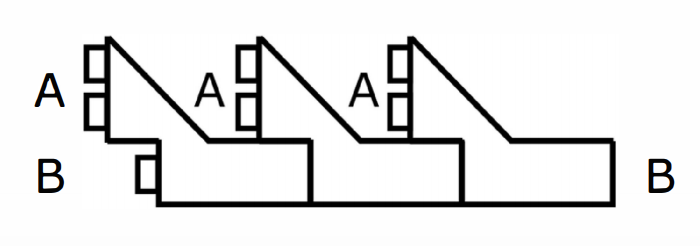
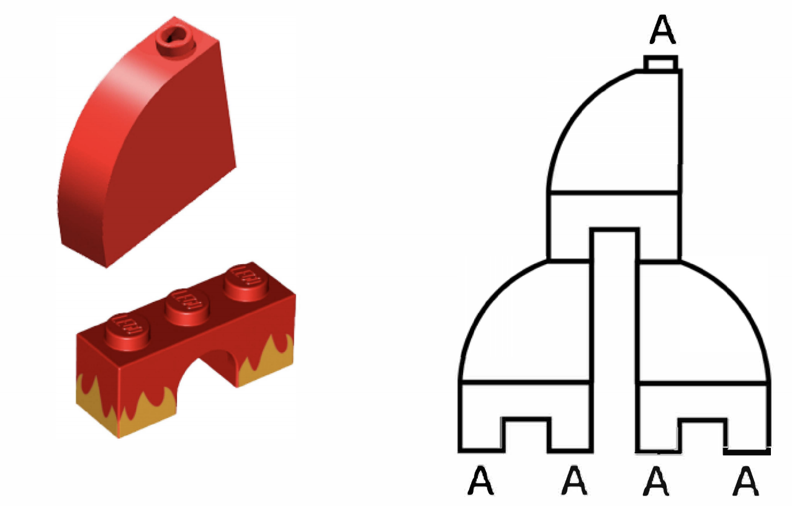
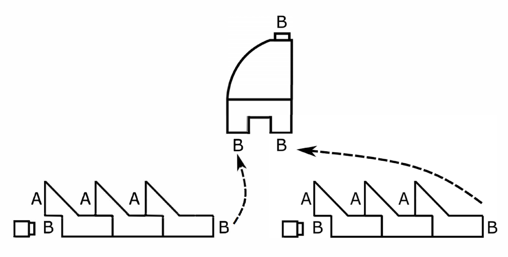

# Reduction Operations

## 1. What we've seen so far

#### 1.1 Review

- Distributed Data Parallelism을 정의하였다
- Apache Spark가 이러한 모델을 구현하는 것을 보았다
- 분산 시스템에서 latency가 무엇을 의미하는지를 배웠다

#### 1.2 Spark's Programming Model

- Spark은 얼핏 보기엔 Scala collections와 유사해보인다
- 그러나 내부적으로 Spark은 Scala collections과는 다르게 동작한다
    - Spark은 시간과 메모리를 절약하기 위해 <b>laziness</b>를 사용한다
- Spark은 transformation과 action 함수로 구성된다
- Spark은 caching과 persistance를 제공한다 (메모리에 캐싱함으로써 시간을 절약)

## 2. Transformations to Actions

앞서 우리는 map, flatMap, filter와 같은 <b>transformations</b> 함수들이 distribute되는 것에 초점을 두었다.
이러한 연산들이 어떻게 distribute되고 parallelize되는지를 말이다.

그렇다면 actions 함수는 어떻게 동작할까? 특히 reduce와 같은 action함수는 Spark에서 어떻게 distribute될까?

확실한 건 map이나 filter와는 많이 다르다는 점이다.

## 3. Reduction Operations, Generally

#### 3.1 Reduction Operations란?

- <b>정의</b>: collection의 인접한 원소들을 결합하여 단일 결과값을 생성하는 것 (collection이 아니라)
- fold, reduce, aggregate 등 Scala sequential collections 및 foldLeft, reduceRight와 같 바리에이션들이 이에 해당한다
- reduce vs map
    - map: 새로운 collection을 반환
    - reduction: integer, double, string과 같은 단일 값을 반환
- 결과를 파일로 저장하는 연산은 reduction operation에 해당하지 않는다는 점에 유의하자

#### 3.2 Taco Order example

아래와 같이 타코주문 총합을 계산하는 예시를 살펴보자

    case class Taco(kind: String, price: Double)
    
    val tacoOrder = 
      List(
        Taco("Carnitas", 2.25),
        Taco("Corn", 1.75),
        Taco("Barbacoa", 2.50),
        Taco("Chicken", 2.00))
    
    val cost = tacoOrder.foldLeft(0.0)((sum, taco) => sum + taco.price)

## 4. Parallel Reduction Operations

#### 4.1 fold vs foldLeft

fold와 foldLeft 중 어느것이 parallelizable한가? -> <b>foldLeft는 parallelizable하지 않다</b>

#### 4.2 foldLeft

foldLeft의 정의를 살펴보자

    def foldLeft[B](z: B)(f: (B, A) => B): B

foldLeft는 왼쪽에서 오른쪽으로 순차적으로 진행함에 따라 결과의 타입이 A에서 B로 변하게 된다.
아래의 예시를 보자

    val xs = List(1, 2, 3, 4)
    val res = xs.foldLeft("")((str: String, i: Int) => str + i)
    
xs를 둘로 나누어 parallelize하게 foldLeft를 수행한다고 가정해보자.
즉 List(1, 2)와 List(3, 4)로 나누어 각자 계산이 수행되는 셈이다.

1. List(1, 2)
    1. "" + 1 -> "1"
    2. "1" + 2 -> "12"
    3. List(1, 2)의 반환값은 String이다
    
2. List(3, 4)
    1. "" + 3 -> "3"
    2. "3" + 4 -> "34"
    3. List(3, 4)의 반환값은 String이다
    
3. 1과 2의 결과에 대해 foldLeft를 수행하면 type error가 발생한다.
    - <b>(String, Int)가 아닌 (String, String)이 입력으로 들어오기 때문</b>
    
#### 4.3 fold

fold는 parallelize가 가능하지만 대신 항상 같은 타입을 반환해야 한다.

    def fold(z: A)(f: (A, A) => A): A
    

#### 4.4 aggregate

aggregate는 Scala collections와 Spark 모두에서 사용되는 일반적인 reduction 오퍼레이션이다

    def aggregate[B](z: => B)(seqop: (B, A) => B, combop: (B, B) => B): B
    
- aggregate의 특징
    -  Parallelizable
    -  반환 타입 변경 가능

- aggregate는 seqop와 combop 두 가지 연산으로 구현된다
    - seqop
        - chunk들 내부에서 타입이 변하는 연산을 정의할 수 있다
    - combop
        - chunk들의 결과를 parallel하게 결합하는 fold 등의 연산을 정의할 수 있다
        
        

## 5. Reduction Operations in RDDs

#### 5.1 Scala collection과 Spark RDD

Spark은 foldLeft / foldRight 연산을 지원하지 않는다. 
따라서 타입이 바뀌어야 하는 경우엔 반드시 aggregate를 사용해야 한다.

Scala collections | Spark RDDs
----------------- | -----
fold | fold
foldLeft/foldRight | ~~foldLeft/foldRight~~
reduce | reduce
aggregate | aggregate

- question: 왜 여전히 Spark에서 foldLeft/foldRight를 지원하지 않는가?
    - 클러스터를 넘나들며 이를 수행하는 것은 매우 어렵다. 많은 synchroniztion이 이뤄져야 한다.
    
#### 5.2 RDD의 Aggregation

Spark에서 가장 바람직한 reduction 연산은 대부분의 경우 aggregate이다. 왜일까?

Spark으로 대용량 데이터를 처리할 때의 목표는 <b>크고 복잡한 데이터 타입을 더 작은 데이터로 project down 시키는 것</b>이기 때문이다.

따라서 aggregate는 Scala collections보다 Spark에서 더욱 유용한 연산이라 할 수 있다.
